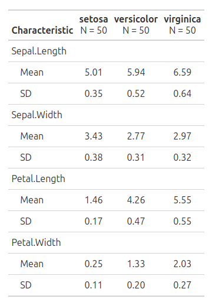
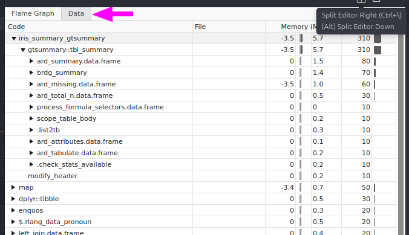
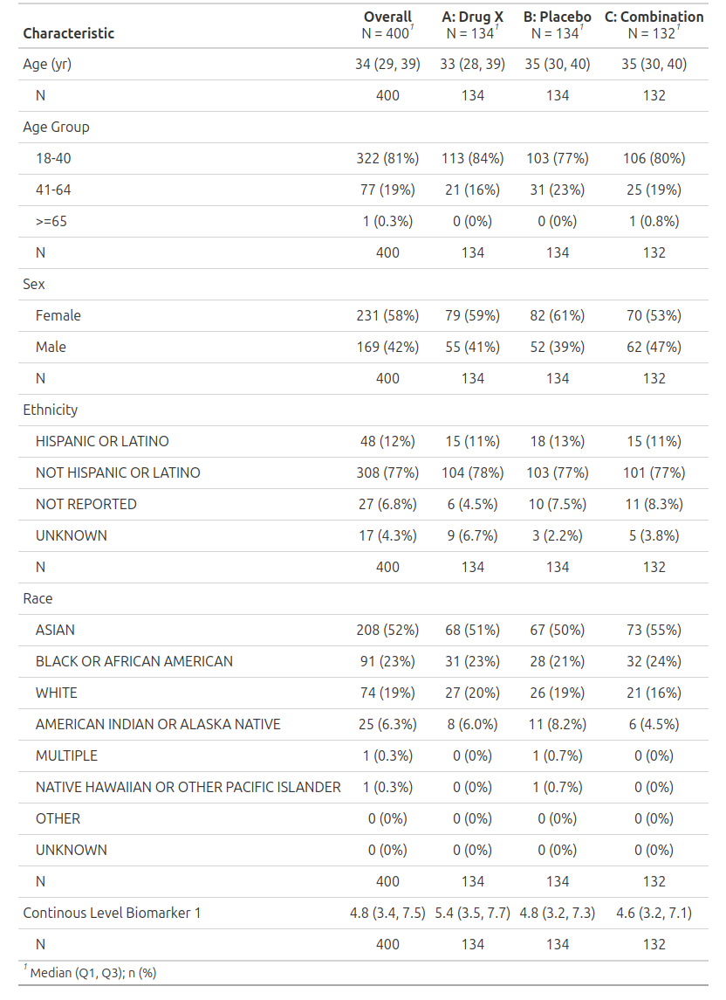
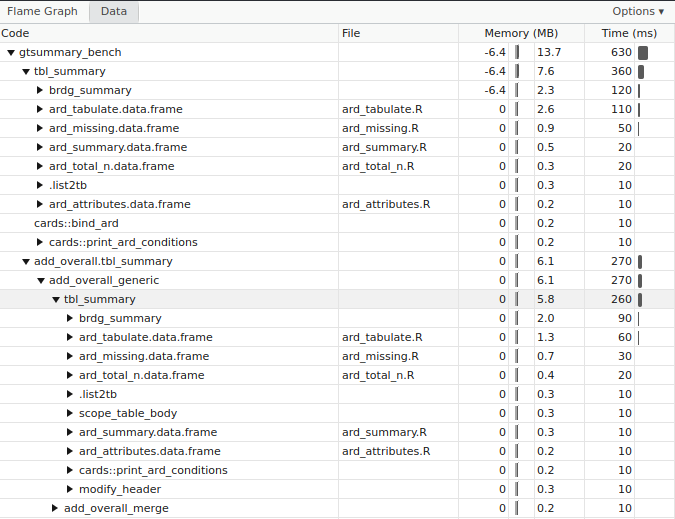

---
format:
  revealjs:
    smaller: true
---

## iris



```.r
# bench::mark() with 10 iterations
# A tibble: 1 × 4
  expression   median  n_gc mem_alloc
  <bch:expr> <bch:tm> <dbl> <bch:byt>
1 iris         361ms    12    1.97MB
```

## iris

> Simplified results from `profvis()`



## DMT01 _(adapted)_



```.r
# bench::mark() with 10 iterations
# A tibble: 1 × 4
  expression          median  n_gc mem_alloc
  <bch:expr>        <bch:tm> <dbl> <bch:byt>
1 DMT01               1.2s    41    6.87MB
```

## DMT01 _(adapted)_

> Simplified results from `profvis()`



## 🏎️ Performance takeaways {style="font-size: 0.5em;"}

- **No simple fix**
  - The packages are inherently complex to support flexibility, and a rich user-facing API

- **Incremental gains**
  - Targeted optimizations yield small, finite improvements _(~150 ms achieved)_

- **Tibble-centric internals**
  - Core data structures are tibbles, used to store statistics, metadata, and intermediate results

- **Transformation-heavy workflows**
  - Extensive use of `mutate()`, joins, nesting / unnesting, ...

- **Memory & GC overhead**
  - They become noticeable contributors to runtime

- **Structural limits**
  - Meaningful speedups would likely require structural refactoring, not isolated changes

- **Selective Paralelization**
  - Explore parallel execution in well-identified mapping steps with sufficient workload per iteration, where overhead is worthwhile

## 🔮 Path forward

- Focus on top contributors:
  - `cards::ard_tabulate()`
  - `gtsummary::brdg_summary()` _(and their `pier_summary_*` internals)_
  - `cards::ard_missing`
  - `cards::get_ard_statistics()` (💡 caching / different data structure)
    - Called 117 times with `DMT01` example.

- Explore **alternative data structures**:
  - `vctrs::data_frame` for performance-critical sections
    - or constrained tibble usage where inputs are fully controlled
  - Others (?custom, `data.table`?)
